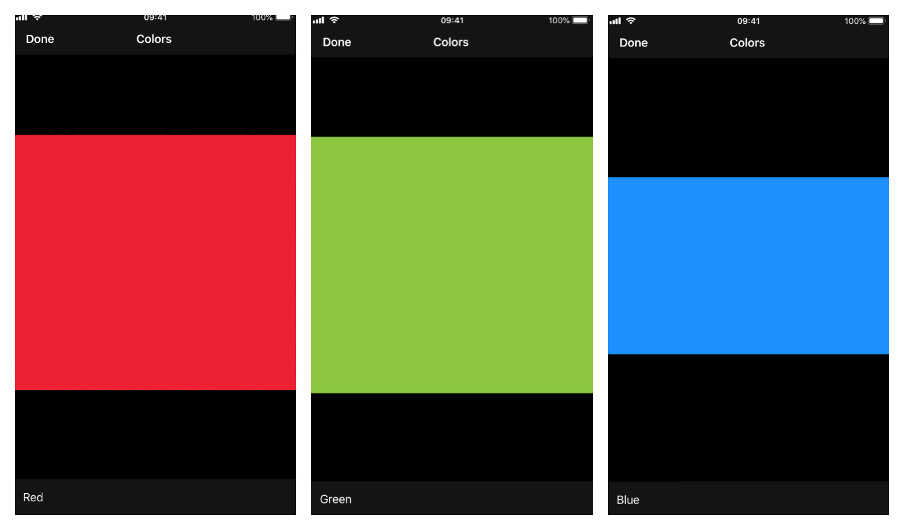

# AURASlideshow

AURASlideshow provides an interface to display a sequence of images and associated text. Ideal for a tutorial inside an app. Suports swiping and Voice Over.

## Installation 

You can install the library from:

### CocoaPods

Add this line in your  `Podfile`:

~~~
pod 'AURASlideshow', '~> 1.0'
~~~

### Carthage

Add this line in your `Cartfile`:

~~~
github "alexaubry/AURASlideshow" ~> 1.0
~~~

## Usage

The contents of the slideshow is defined as an array of objects conforming to the `SlideshowItem` protocol. Each object provides an image and a description of the item.

The first step is to import the framework and define your data source:

~~~swift
import AURASlideshow

enum ColorSlideshow: String, SlideshowItem, CaseIterable {

    case red = "Red"
    case green = "Green"
    case blue = "Blue"
    
    var image: UIImage {
        return UIImage(named: "Slideshow-\(rawValue)")
    }
    
    var localizedValue: String {
        return rawValue
    }
    
}
~~~

Then, create the view controller, wrap it inside a navigation controller, and present it from a view controller:

~~~swift
func presentSlideshow() {
    let slideshow = SlideshowViewController(title: "Colors", items: ColorSlideshow.allCases)
    let slideshowNavigation = UINavigationController(rootViewController: slideshow)
    self.present(slideshowNavigation, animated: true, completion: nil)
}
~~~

## Contributing

Thank you for your interest in the project! Contributions are welcome and appreciated.

Make sure to read these guides before getting started:

- [Code of Conduct](CODE_OF_CONDUCT.md)
- [Contribution Guidelines](CONTRIBUTING.md)

## Author

Written by Alexis Aubry. You can [find me on Twitter](https://twitter.com/_alexaubry).

## License

AURASlideshow is available under the MIT license. See the [LICENSE](LICENSE) file for more info.
